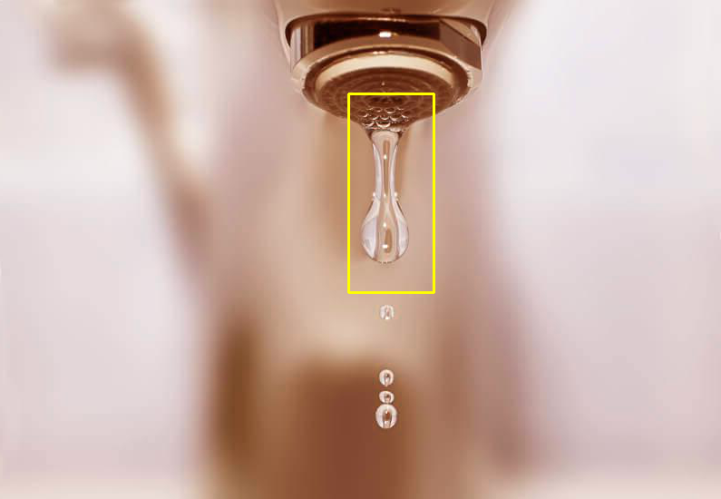

## Introduction:       
In this notebook I have performed transfer learning on custom dataset with a pretrained object detection model. The dataset is a collection of images of water leaking from different faucets & fittings. This is a simulation model to detect leakages of liquids in an industrial setup.   
## Dataset:   
The data set contains 74 images dowloaded from the internet. I have labelled these images using an open source annotation tools called VGG image annotator 
There is another set of 24 images kept aside for testing. The target class is water droplet leaking out of a pipe fitting/joint.    
**Train Sample**    

<!-- [train sample](img/train_sample.png) -->

## Algorithm:
The algorithm is a pretrained FasteRCNN model with a RestNet50 network as backbone. This is a pretrained model on coco dataset. Only the final detection layers are modified to suit the number of target classes in our custom dataset. The accuracy of this model is good but the model suffers with slow inference speed. For realtime detection faster networks like ssd and yolo are more suitable 

**Test Results**   

